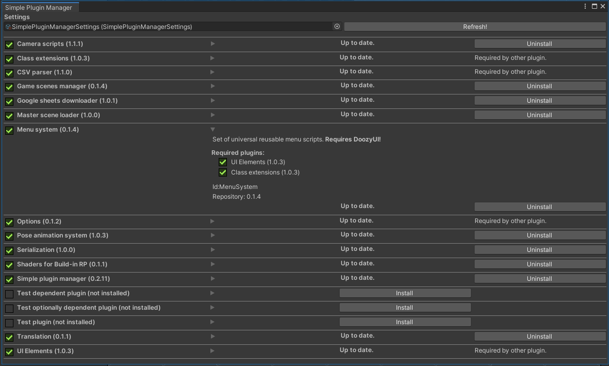

# Simple Plugin Manager
**Simple Plugin Manager** is a lightweight Unity tool that manages folder based plugins stored on HDD repository.
It can handle dependencies and also supports optional dependencies through global defines in unity project.

In action it looks like this: (plugins are not included :-) )


## Installation
 * download and copy **Simple Plugin Manager** to your project
 * create a folder outside your projects - that will be your plugin repository
 * inside your project *Assets* folder create settings asset
   * right click and then: *Create &rarr; Create SimplePluginManager settings*
 * configure your settings:
   * add absolute path to your repository folder on HDD
   * you can have multiple paths if your project is shared on multiple computers (just one path must be valid at the time)
   * set relative path to your plugins inside your project under **Assets** 
 * run plugin manager: *Tools &rarr; Simple Plugin Manager*
 
## How to make a plugin
* create folder in repository or in plugins folder inside unity project
* add any files you want there
* create **plugin.json**

### plugin.json structure
Example json structure:
```json
{
  "Id":"MyPluginId",
  "Name":"Name visible in manager",
  "Description" : "Description. <b>Bold</b> and <i>italic</i> texts are supported.",
  "Version":"0.1.0",
  "Dependencies":["OtherPluginId"],
  "GlobalDefines":["MY_PLUGIN_INSTALLED"]
}
```
* **Id** must be unique across all your plugins.
* **Name** is visible name, keep it short.
* **Description** is longer plugin description visible after plugin ui is expanded.
* **Version** _**MUST**_ follow **Semantic versioning** standard: `MAJOR.MINOR.PATCH-PRE.RELEASE+META`. See https://semver.org/
* **Dependencies** is optional array of Id's of other plugins, your plugin is dependent on.
* **GlobalDefines** is optional array of global defines that will be added to your unity project settings when plugin is installed (and removed when it's uninstalled). Defines can be used for optional dependencies on the plugin. 

## Working on plugins
Modify your plugin in your unity project. When you increase version in *plugin.json* manager will offer your to downgrade plugin back from repository or copy new version to repository.
 
